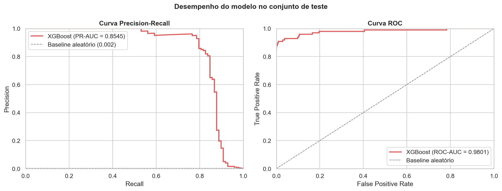

# Fraud Detection — End-to-End ML Pipeline


Detecção de fraude em transações de cartão de crédito usando um pipeline
end-to-end com scikit-learn — do dado bruto até a análise de interpretabilidade.

## Resultados

| Métrica | Score |
|---------|-------|
| PR-AUC  | 0.8545 |
| ROC-AUC | 0.9801 |
| Recall (threshold ótimo) | 0.9506 |
| Precision (threshold ótimo) | 0.7857 |



## Pipeline
```
Dados brutos → EDA → StandardScaler + SMOTE → XGBoost → Avaliação → SHAP
```

## Estrutura do projeto
```
fraud-detection-ml/
├── data/
├── notebooks/fraud_detection.ipynb
├── src/pipeline.py
├── models/best_model.pkl
├── reports/figures/
└── requirements.txt
```

## Como executar
```bash
git clone https://github.com/seu-usuario/fraud-detection-ml.git
cd fraud-detection-ml
python -m venv venv && source venv/bin/activate
pip install -r requirements.txt
jupyter notebook notebooks/fraud_detection.ipynb
```

## Dataset

[Credit Card Fraud Detection — Kaggle](https://www.kaggle.com/datasets/mlg-ulb/creditcardfraud)